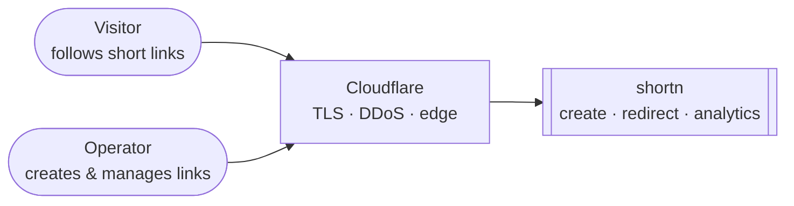
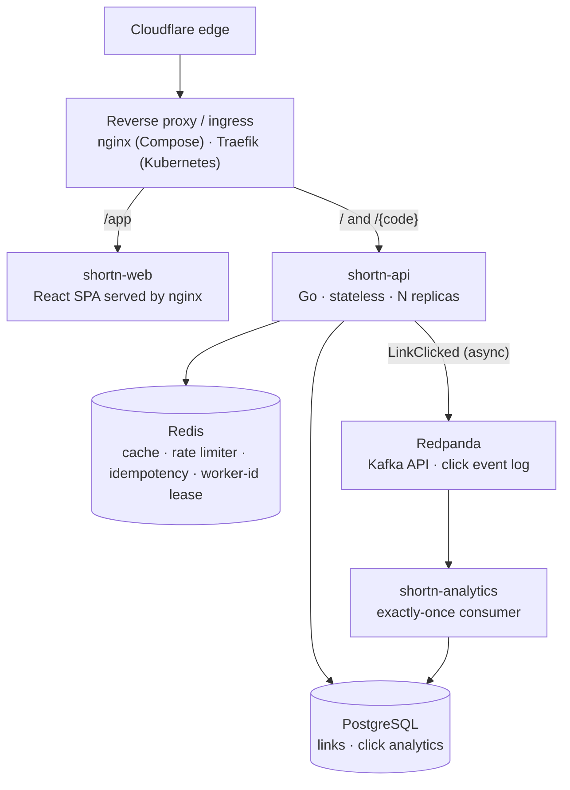
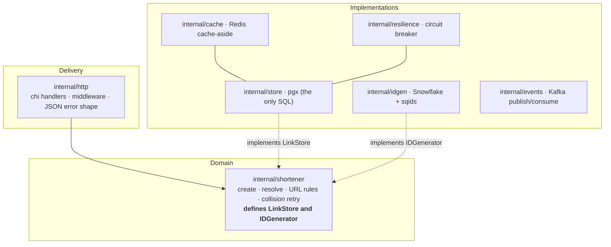

# Architecture

`shortn` is a URL shortener: `POST /api/links` returns a short code, and `GET /{code}`
serves a `302` redirect to the original URL. The redirect path is read-heavy and latency-
sensitive, so it is served from a Redis read-through cache backed by PostgreSQL. Short codes
come from a coordination-free Snowflake-style generator and are obfuscated with sqids so they
are non-sequential. Every redirect publishes a click event to Redpanda and returns
immediately; a separate consumer drains that log into Postgres with exactly-once processing.
The API is stateless and runs behind a reverse proxy across several instances.

This document is the map. It covers the system in context, the containers it is built from,
the layered design that keeps the core swappable, and the path a request takes. Each
significant decision links to its [Architecture Decision Record](docs/architecture/README.md).

## System context

The system is self-contained: it depends on no third-party APIs. The only thing in front of
it is Cloudflare, which terminates TLS at the edge, absorbs DDoS traffic, and hides the
origin IP.



Access is anonymous by design: anyone may create a link, follow a code, or read a code's
stats (knowing the code is the key to its analytics). Listing every link and deleting a link
are the only privileged operations, gated by an admin key. See
[the access model](docs/explanation/access-and-analytics-model.md).

## Containers

A "container" here is a separately deployable process or datastore, in the
[C4](https://c4model.com/) sense.



- **shortn-api** (`cmd/api`) is the core service: it creates links, serves redirects, and
  exposes the management and stats endpoints. It holds no in-memory state, so it scales
  horizontally behind the proxy.
- **shortn-analytics** (`cmd/analytics`) is a separate binary that consumes the click event
  log and writes counts to Postgres. It is built from the same `Dockerfile` as the API
  (`--build-arg SERVICE=analytics`).
- **shortn-web** (`web/`) is the React dashboard, built to static files and served by nginx
  under `/app`.
- **Redis** is a multi-purpose coordination store: the read-through cache, the distributed
  rate-limiter's token buckets, the idempotency-key records, and the Snowflake worker-id
  leases. None of it is a source of truth — a Redis outage degrades performance, never
  correctness.
- **PostgreSQL** is the single source of truth for links and click counts.
- **Redpanda** is a Kafka-API-compatible event log that decouples click recording from the
  redirect hot path.

Telemetry is exported directly to its backends, without an OpenTelemetry Collector in the
middle: Prometheus scrapes each instance's `/metrics`, traces are pushed over OTLP to Tempo,
and Grafana Alloy ships container logs to Loki. See [ADR 0010](docs/architecture/0010-observability.md)
and [the observability explainer](docs/explanation/observability.md).

The live public deployment runs a lean profile — Redpanda, the analytics consumer, and the
observability stack are gated off to fit a small single-node cluster. The full system runs
under Docker Compose and on a local Kubernetes cluster. See [the deployment topology](docs/deployment.md).

## Layered design and dependency inversion

The code is organized so that the core domain logic depends on interfaces, never on concrete
I/O. The dependency arrows point inward, toward the domain.



The rule that makes this work, and the one to defend: **`internal/shortener` imports no
`database/sql`, no `pgx`, and no `net/http`.** It declares the interfaces it needs —
`LinkStore` and `IDGenerator` — and receives implementations through its constructor. The
HTTP layer knows how to speak HTTP and nothing about SQL; the store layer is the only place
SQL lives; the domain in between knows neither.

The payoff is that implementations swap without touching business logic. A Postgres store
becomes a fake in a unit test; a random-base62 generator becomes a Snowflake generator;
caching and the circuit breaker are added as decorators that also satisfy `LinkStore`,
wrapping the real store without the domain noticing. The cost of change stays flat as the
system grows, which is the property the whole layout exists to protect. See
[the clean-architecture explainer](docs/explanation/clean-architecture-and-di.md) and the
interface decisions in [ADR 0004](docs/architecture/0004-id-generation-strategy.md),
[0006](docs/architecture/0006-caching-strategy.md), and [0009](docs/architecture/0009-resilience.md).

### The composition root

`cmd/api/main.go` is the one place that knows how the program is assembled. It constructs
every concrete dependency and injects it downward; nothing under `internal/` reaches for a
global. The wiring order is deliberate:

1. **Config** is loaded from the environment. Bad config fails fast — the process never boots
   into a running-but-broken state.
2. **Logging** is a `log/slog` JSON handler, set as the default.
3. **Observability** is set up early so every component below can emit signals. The trace
   exporter connects lazily, so an unreachable Tempo never blocks startup.
4. **Postgres** is a hard dependency: the pool is pinged at startup and the process exits if
   the database is unreachable.
5. **Redis** is not a hard dependency: a failed ping is a warning, and the service starts
   anyway, serving uncached from Postgres (fail-open).
6. **Worker ID** is resolved next. An explicit `WORKER_ID` wins (used under Compose, where
   ids are assigned by hand); otherwise the instance leases a free id from Redis (used on
   Kubernetes, where every pod runs the same image). A pod that cannot get a unique id
   refuses to start — unlike the cache, id assignment cannot fail open. See
   [ADR 0014](docs/architecture/0014-worker-id-assignment.md).
7. **The store is composed from the inside out**: the raw pgx store is wrapped by the circuit
   breaker, which is wrapped by the Redis cache. The domain service receives the cache-
   wrapped store and never sees the raw one.
8. **The publisher, rate limiter, and idempotency store** are constructed and injected into
   the router.
9. **Two servers start**: the public API on `PORT`, and an internal-only operations server on
   `OPS_PORT` carrying `/healthz`, `/readyz`, and `/metrics`. The ingress routes only the
   public port, so the health and metrics surfaces never reach the internet.
10. **Shutdown is graceful.** On `SIGTERM` the process keeps serving for a short delay so the
    load balancer deregisters it first (avoiding the endpoint-deregistration race), then
    drains in-flight requests before exit.

## What happens on a request

**Create — `POST /api/links`.** The request passes the rate limiter, then an idempotency
check (a repeated `Idempotency-Key` returns the original code rather than minting a new one).
The domain validates and normalizes the URL, rejecting non-`http(s)` URLs and addresses that
resolve to private, loopback, or link-local ranges. It asks the generator for a Snowflake id
and encodes it with sqids into a short code, then writes the link through the store. The
response is the code and the full short URL.

**Redirect — `GET /{code}`.** The request passes the rate limiter, then the domain resolves
the code. The cache is checked first: a hit returns the URL with Postgres untouched; a miss
falls through the circuit breaker to Postgres and populates the cache (with a short-lived
negative entry if the code does not exist, so a missing code is not looked up repeatedly).
The handler writes the `302`, then publishes a `LinkClicked` event to Redpanda without
blocking the response. The analytics consumer drains that event into Postgres, committing the
Kafka offset in the same transaction as the click insert, so a crash or restart never loses
or double-counts a click. See [the request-lifecycle walkthrough](docs/request-lifecycle.md)
for the full sequence, and [ADR 0008](docs/architecture/0008-messaging-and-delivery-semantics.md)
for the exactly-once guarantee.

## Cross-cutting properties

- **Horizontal scale.** The API is stateless, so the proxy round-robins across instances and
  more replicas add throughput. Each instance has a unique worker id, so the coordination-
  free id generator never collides. ([0007](docs/architecture/0007-distributed-id-generation.md),
  [0014](docs/architecture/0014-worker-id-assignment.md))
- **Resilience.** Every downstream call runs under a timeout; a Redis-backed distributed rate
  limiter is shared across instances (`429` + `Retry-After`); a circuit breaker fails fast
  when Postgres is down; idempotency keys dedupe retried creates. ([0009](docs/architecture/0009-resilience.md))
- **Fail-open caching.** The cache and event publisher are optimizations behind interfaces; a
  Redis or Redpanda outage degrades latency or delays analytics, never correctness.
  ([0006](docs/architecture/0006-caching-strategy.md))
- **Exactly-once analytics.** The offset commit and the click insert share one transaction,
  which is the boundary that makes recording exactly-once. ([0008](docs/architecture/0008-messaging-and-delivery-semantics.md))
- **Operational isolation.** Health, readiness, and metrics live on a separate internal port,
  off the public ingress. `/healthz` is dependency-free; `/readyz` checks Postgres.
- **Zero-downtime deploys.** A readiness probe plus a post-`SIGTERM` deregistration delay and
  graceful drain let rolling updates proceed without dropped requests. ([0011](docs/architecture/0011-orchestration.md))

## Technology decisions

Each row is an accepted decision with its own record. The records hold the alternatives that
were weighed and what each choice costs.

| Area                 | Choice                                                            | Record                                                                                                                |
| -------------------- | ----------------------------------------------------------------- | --------------------------------------------------------------------------------------------------------------------- |
| Language / runtime   | Go (static binary, goroutine concurrency, cloud-native ecosystem) | [0001](docs/architecture/0001-language-and-runtime.md)                                                                |
| Configuration        | 12-factor: `os.Getenv` → `Config` struct → `Load()`               | [0002](docs/architecture/0002-config-from-environment.md)                                                             |
| Container image      | Multi-stage build → `gcr.io/distroless/static:nonroot`            | [0003](docs/architecture/0003-container-strategy.md)                                                                  |
| HTTP router          | chi v5 (handlers are plain `http.Handler`)                        | —                                                                                                                     |
| Logging              | `log/slog`, JSON handler                                          | —                                                                                                                     |
| Database             | PostgreSQL via pgx                                                | [0005](docs/architecture/0005-url-normalization.md)                                                                   |
| ID generation        | Snowflake id + sqids encoding                                     | [0004](docs/architecture/0004-id-generation-strategy.md), [0007](docs/architecture/0007-distributed-id-generation.md) |
| Worker-id assignment | Redis lease (collision-safe horizontal scale)                     | [0014](docs/architecture/0014-worker-id-assignment.md)                                                                |
| Caching              | Cache-aside Redis decorator, negative caching, singleflight       | [0006](docs/architecture/0006-caching-strategy.md)                                                                    |
| Messaging            | Redpanda (Kafka API), offset-in-transaction exactly-once          | [0008](docs/architecture/0008-messaging-and-delivery-semantics.md)                                                    |
| Resilience           | Timeouts, distributed rate limiter, circuit breaker, idempotency  | [0009](docs/architecture/0009-resilience.md)                                                                          |
| Observability        | Prometheus, Grafana, Loki, Tempo via the OpenTelemetry SDK        | [0010](docs/architecture/0010-observability.md)                                                                       |
| Orchestration        | Kubernetes, packaged with Helm                                    | [0011](docs/architecture/0011-orchestration.md)                                                                       |
| Delivery             | GitOps with ArgoCD, images on GHCR                                | [0012](docs/architecture/0012-gitops-delivery.md)                                                                     |
| Infrastructure       | Terraform for the cluster and platform                            | [0013](docs/architecture/0013-infrastructure-as-code.md)                                                              |

## Repository layout

The module path is `github.com/Ashfak-Hossain/shortn`. Go's `internal/` rule keeps those
packages private to the module, so the domain logic cannot accidentally become a public API.
Each `cmd/<name>` is one binary and stays thin — wiring only.

```text
shortn/
├── cmd/
│   ├── api/             API service entrypoint (the composition root)
│   └── analytics/       Click-event consumer
├── internal/
│   ├── config/          Config struct + Load() from the environment
│   ├── http/            chi router, handlers, middleware, ops router
│   ├── shortener/       Core domain; defines LinkStore and IDGenerator
│   ├── store/           pgx Postgres repository (the only SQL)
│   ├── cache/           Redis cache-aside decorator
│   ├── resilience/      Circuit breaker around the store
│   ├── idgen/           Snowflake generator + sqids + the worker-id lease
│   ├── events/          Kafka/Redpanda publish and consume
│   ├── idempotency/     Idempotency-Key records
│   ├── ratelimit/       Distributed token-bucket rate limiter
│   └── observability/   OpenTelemetry setup (metrics, traces)
├── migrations/          golang-migrate SQL (paired up/down)
├── deploy/
│   ├── compose/         The single growing docker-compose stack
│   ├── k8s/             Helm chart (deploy/k8s/shortn)
│   └── terraform/       Cluster + platform as code
├── load/                k6 load scripts
└── web/                 React dashboard
```

## Further reading

- [Architecture Decision Records](docs/architecture/README.md) — why each choice was made.
- [Request lifecycle](docs/request-lifecycle.md) — create and redirect traced end to end.
- [Deployment topology](docs/deployment.md) — how the live system is wired and run.
- [Performance](docs/performance.md) — load-test method and results.
- [Runbook](docs/runbook.md) — failure modes and operational procedures.
- [Explanation deep-dives](docs/explanation/) — caching, distributed ids, messaging,
  observability, resilience, security, and the access model in depth.
