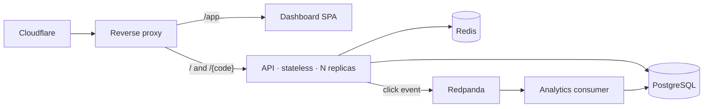

# shortn

A distributed URL shortener built to production-grade: caching, a message queue,
resilience, observability, and a Kubernetes/GitOps deployment.

[](https://github.com/Ashfak-Hossain/shortn/actions/workflows/ci.yml)
[](LICENSE)
[](go.mod)

**Live:** **[shortn.ashfak.dev](https://shortn.ashfak.dev)** — try the
[dashboard](https://shortn.ashfak.dev/app), or `POST` to the API.

`POST /api/links` returns a short code; `GET /{code}` issues a `302` redirect. The redirect
path is served from a Redis read-through cache backed by PostgreSQL, behind a load balancer
across stateless API instances. Short codes come from a coordination-free Snowflake generator
and are obfuscated with sqids. Every click is recorded asynchronously through Redpanda with
exactly-once processing, so analytics never slow the redirect down.

## What it does

- **Shorten and redirect.** Create a link, follow a code with a `302`. The read path is
  cache-aside on Redis; a cache hit never touches Postgres.
- **Scales horizontally.** Stateless API instances behind a reverse proxy. Each instance
  leases a unique Snowflake worker id, so id generation never collides as replicas grow.
- **Records clicks asynchronously.** A redirect publishes a `LinkClicked` event and returns;
  a separate consumer drains the log into Postgres, committing the queue offset in the same
  transaction as the click insert (exactly-once).
- **Stays up under failure.** Per-call timeouts, a distributed rate limiter, a circuit
  breaker on Postgres, and idempotency keys. Cache and broker outages fail open.
- **Is observable.** Metrics, logs, and traces through the OpenTelemetry SDK; one click is a
  single trace from the edge through the queue to the analytics insert.
- **Ships on Kubernetes.** Packaged as a Helm chart, delivered by ArgoCD (GitOps), autoscaled
  by an HPA, with zero-downtime rolling updates; the cluster is declared in Terraform.

## Architecture



The domain depends on interfaces, not concrete I/O: `internal/shortener` defines `LinkStore`
and `IDGenerator` and imports no SQL and no `net/http`. The store, cache, circuit breaker,
and id generator are implementations injected at the composition root, so each swaps without
touching business logic. The full design, the request paths, and the C4 diagrams are in
**[ARCHITECTURE.md](ARCHITECTURE.md)**.

## Performance

Measured with k6 against the full stack. The headline is a found-fixed-remeasured bottleneck:
nginx had no upstream keepalive, so it opened a fresh TCP connection per request. Adding a
keepalive pool cut redirect **p99 from 172 ms to 11 ms** under identical load, with the median
unchanged — a connection-queueing problem, not a compute one. Under CPU load the API
autoscales 1 → 4 pods and back. The numbers come from a single laptop with the load generator
co-resident, so the trustworthy signal is the relative before/after, not absolute throughput.
Full method and results: **[docs/performance.md](docs/performance.md)**.

## Tech stack

| Concern        | Choice                                              |
| -------------- | --------------------------------------------------- |
| Language       | Go                                                  |
| HTTP router    | chi v5                                              |
| Database       | PostgreSQL (pgx)                                    |
| Cache          | Redis                                               |
| Message queue  | Redpanda (Kafka API)                                |
| Reverse proxy  | nginx (Compose) · Traefik (Kubernetes)              |
| Observability  | Prometheus · Grafana · Loki · Tempo (OpenTelemetry) |
| Orchestration  | Kubernetes · Helm · ArgoCD                          |
| Infrastructure | Terraform                                           |
| Frontend       | React (Vite + TypeScript)                           |

## Quick start

Requires Go 1.26+, Docker, and `make`.

```sh
docker compose -f deploy/compose/docker-compose.yml up --build
```

This starts Postgres, Redis, and Redpanda, applies migrations, and serves the API behind
nginx on `:80`.

```sh
# create a short link
curl -s -X POST localhost/api/links -d '{"url":"https://example.com"}'
# → {"code":"Ab3xK9p","short_url":"http://localhost/Ab3xK9p","long_url":"https://example.com"}

# follow it — 302 redirect to the original URL
curl -i localhost/Ab3xK9p

# errors use a consistent shape: {"error":"..."}
curl -i localhost/unknown                                # 404
curl -i -X POST localhost/api/links -d '{"url":"nope"}'  # 400
```

The full local stack including the observability backends comes up with `make up` (Grafana on
`localhost:3000`). The API contract is in [docs/reference/api.md](docs/reference/api.md).

## Documentation

- **[ARCHITECTURE.md](ARCHITECTURE.md)** — system overview, diagrams, request paths.
- **[Architecture Decision Records](docs/architecture/README.md)** — why each choice was made.
- **[docs/](docs/README.md)** — the full index: explanation deep-dives, reference, operations.
- **[Deployment](docs/deployment.md)** — how the live system is wired and run.
- **[Runbook](docs/runbook.md)** — failure modes and operational procedures.
- **[Performance](docs/performance.md)** — load-test method and results.
- **[Security](SECURITY.md)** — threat model and responsible disclosure.

## License

[MIT](LICENSE)
