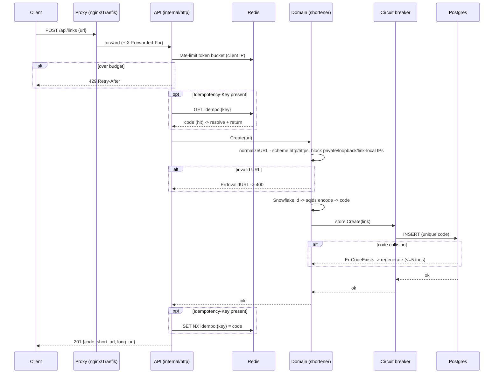

# Request lifecycle

This traces the two paths that carry almost all of shortn's traffic: creating a short
link (`POST /api/links`) and following one (`GET /{code}`). Each starts at the client,
passes the edge proxy, and lands in the API process, where the middleware chain and the
domain service do the work. The redirect path also fans out asynchronously into the
analytics consumer.

For the layering that makes this possible — the domain depending on `LinkStore` /
`IDGenerator` interfaces rather than on Postgres or Redis directly — see
[../ARCHITECTURE.md](../ARCHITECTURE.md). The asynchronous half is covered by
[ADR 0008](architecture/0008-messaging-and-delivery-semantics.md) and the
[messaging explainer](explanation/messaging-and-exactly-once.md).

## The shared front of every request

Both paths enter through the same middleware chain, registered in
`internal/http/router.go`, outermost first:

1. `otelhttp` reads the inbound W3C `traceparent`, starts the server span, and records
   the `http.server.*` metrics. It is outermost so the span covers middleware time.
2. `ServedByMiddleware` stamps `X-Served-By` with the instance ID.
3. `TimeoutMiddleware` binds a 2 s deadline (`requestTimeout` in `cmd/api/main.go`) onto
   the request context. A redirect resolves in single-digit milliseconds; 2 s is a
   failure ceiling that stops one frozen dependency from parking goroutines and draining
   the pgx pool, not a target.
4. `RouteTagMiddleware` sets the span name and metric label to the bounded route template
   (`/{code}`, not the expanded path), so time-series cardinality stays fixed.
5. `RateLimitMiddleware` runs a Redis-backed token bucket keyed on the client IP.

The rate-limit key comes from `clientIP`: the right-most entry of `X-Forwarded-For`,
which the one trusted proxy in front of the API (nginx in compose, Traefik on k3s)
appends with the real edge address. A forged `X-Forwarded-For` only prepends entries, so
the proxy's appended value still wins. The default budget is 10 rps sustained with a
burst of 20 (`RATE_LIMIT_RPS` / `RATE_LIMIT_BURST`); Azure runs 20/40. Over budget
returns `429` with a `Retry-After` header. If Redis is unreachable the limiter fails
open and allows the request — it is abuse protection, not a correctness dependency.

Health, readiness, and metrics are not on this chain. They listen on a separate internal
port (`OPS_PORT`, default 9090) so `/metrics` and `/readyz` never reach the internet.

## Create: `POST /api/links`



The handler is `createLink` in `internal/http/links.go`. After decoding the JSON body
and rejecting an empty `url` at the boundary, it runs the idempotency fast path: a
request carrying an already-seen `Idempotency-Key` gets the original code back instead of
a new one. The lookup fails open, so a Redis blip degrades to possible duplicates, never
to a failed create.

The handler then calls `svc.Create` (`internal/shortener/shortener.go`), which does three
things.

It normalizes and validates the URL in `normalizeURL`. It lower-cases the scheme, rejects
anything that isn't `http` or `https` (so `javascript:` and `file:` can't be shortened),
requires a host, and refuses IP-literal destinations in private, loopback, link-local
(including the cloud-metadata `169.254.169.254`), unspecified, or multicast ranges. There
is no DNS lookup and no server-side fetch, so a hostname that resolves to such an address
is out of scope by design; see
[security-ssrf-and-redirects.md](explanation/security-ssrf-and-redirects.md).

It generates the code. A Snowflake ID — 41-bit millisecond timestamp, 10-bit worker ID,
12-bit per-ms sequence — is packed into one 64-bit integer and sqids-encoded into a short
string. The worker ID is unique per instance (explicit `WORKER_ID` in compose, a Redis
lease on Kubernetes), so two pods never mint the same code.

It writes through the store. The service holds a cache-wrapped store, so the call is
`cache -> circuit breaker -> Postgres`. On create there is nothing to cache yet, so the
cache layer delegates straight through. The breaker (`internal/resilience`) protects the
`INSERT`. Writes are not retried: a retried insert whose first attempt actually succeeded
would create a duplicate link.

The database's unique constraint on `code` is the real collision guard. If the insert
hits an existing code, the store returns `ErrCodeExists` and the service silently
regenerates, up to five attempts (`maxCreateRetries`).

On success the handler records `Idempotency-Key -> code` with `SET NX`. If another
concurrent request won that key first (`won == false`), it returns the winner's link
instead, so concurrent retries of the same key converge on one code. The response is
`201` with the code, the absolute short URL (scheme and host inferred from the request),
and the long URL.

Error mapping: `ErrInvalidURL -> 400`; a blown deadline or an open breaker
(`ErrUnavailable`) -> `503 service temporarily unavailable`; anything else -> `500`.

## Redirect: `GET /{code}`

```mermaid
sequenceDiagram
    participant C as Client
    participant P as Proxy (nginx/Traefik)
    participant API as API (internal/http)
    participant R as Redis
    participant CB as Circuit breaker
    participant PG as Postgres
    participant RP as Redpanda
    participant AN as Analytics consumer

    C->>P: GET /{code}
    P->>API: forward (+ X-Forwarded-For)
    API->>R: rate-limit token bucket
    API->>R: GET link:{code}
    alt cache hit
        R-->>API: long URL (or tombstone -> 404)
    else cache miss
        API->>CB: store.GetByCode(code)
        CB->>PG: SELECT (with retry on transient error)
        alt not found
            PG-->>API: ErrNotFound -> negative-cache 30s -> 404
        else found
            PG-->>API: link -> cache SET link:{code} (1h)
        end
    end
    API-->>C: 302 Found -> long URL
    Note over API,RP: response already sent
    API-)RP: publish LinkClicked (goroutine, no blocking)
    RP-->>AN: deliver record
    AN->>PG: BEGIN; INSERT click; SAVE offset; COMMIT
```

The handler is `redirect` in `internal/http/links.go`. It pulls `code` from the path and
calls `svc.Resolve`, which is a `GetByCode` straight through the same cache-wrapped store.

The cache layer (`internal/cache/store.go`) is read-through. A hit returns the long URL
immediately; a cached tombstone (`\x00notfound`) means "known absent" and yields
`ErrNotFound`. A miss collapses concurrent lookups for the same code into one DB load via
singleflight, then goes `circuit breaker -> Postgres`. A found link is cached for 1 h
(`cacheTTL`); a genuine miss is negative-cached as a tombstone for 30 s (`negativeTTL`),
so a flood of requests for a non-existent code can't hammer the database. A Redis error
anywhere here is non-fatal: it logs and falls back to Postgres.

On a hit, the response is a `302 Found`, deliberately not a `301`, which browsers cache
aggressively and would silently bypass click tracking. `ErrNotFound -> 404`;
`ErrUnavailable` or a blown deadline -> `503`.

### The asynchronous tail

Click tracking must never add latency to a redirect or fail one. After `http.Redirect`
has put the response on the wire, the handler builds a `LinkClicked` event and publishes
it in a goroutine. The publish context is `context.WithoutCancel(r.Context())`: detached
from the request's cancellation so it survives the handler returning, but keeping the
trace context so the publish span joins this redirect's trace rather than orphaning into
a new one. A publish failure is logged and swallowed; the redirect already succeeded.

The event is produced to Redpanda keyed by `code`, so all clicks for one link land on the
same partition and stay ordered. The analytics consumer (`cmd/analytics/main.go`) drains
the topic. For each record it runs `process`, which opens a single Postgres transaction
and, inside it, inserts the click and advances the stored Kafka offset (`SaveOffset`),
then commits. Recording the click and advancing past it commit together or not at all.
The consumer commits offsets to Postgres, not to Kafka (`DisableAutoCommit`), and on
partition assignment seeks each partition to the offset read back from Postgres, so a
restart resumes exactly where the last committed transaction left off. That is the
exactly-once guarantee; the click insert's `ON CONFLICT` keeps any partial replay
idempotent.

If `process` fails on a record, the consumer exits rather than advancing past it. On
restart it seeks from Postgres and reprocesses that exact record. A malformed event is a
poison pill: today it is fatal; a dead-letter topic is the production answer. Both are
described further in
[ADR 0008](architecture/0008-messaging-and-delivery-semantics.md).

## Where the numbers come from

| Knob | Value | Source |
| --- | --- | --- |
| Request deadline | 2 s | `requestTimeout`, `cmd/api/main.go` |
| Rate limit (default) | 10 rps, burst 20 | `RATE_LIMIT_RPS` / `RATE_LIMIT_BURST` |
| Rate limit (Azure) | 20 rps, burst 40 | deployment env |
| Positive cache TTL | 1 h | `cacheTTL`, `cmd/api/main.go` |
| Negative cache TTL | 30 s | `negativeTTL`, `internal/cache/store.go` |
| Create retries | <= 5 | `maxCreateRetries`, `internal/shortener` |
| Idempotency TTL | 24 h | `idempotencyTTL`, `cmd/api/main.go` |
| Public port / ops port | 8080 / 9090 | `PORT` / `OPS_PORT` |
